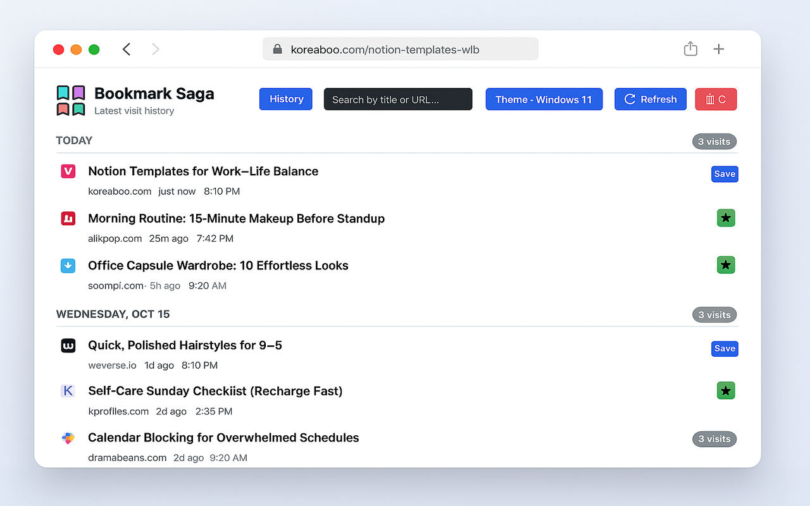
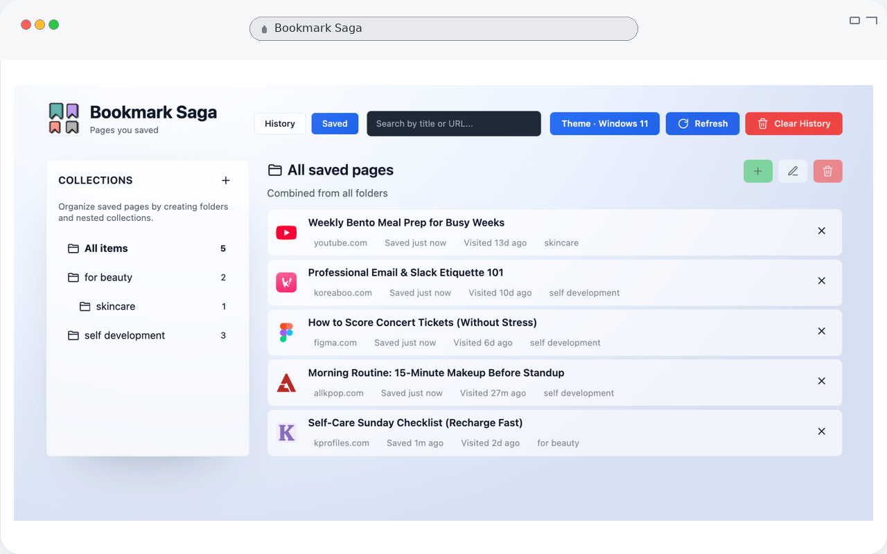

# Bookmark Saga

Bookmark Saga is a browser extension that replaces the New Tab page with a visit dashboard and a lightweight bookmark system.

## Preview

## Development

- `pnpm install` – install dependencies (runs `wxt prepare` automatically)
- `pnpm dev` – start the WXT dev runner (opens the extension in Chrome by default)
- `pnpm dev:firefox` – run the dev runner against Firefox
- `pnpm build` – produce a production build in `dist/`
- `pnpm zip` – create a distributable ZIP archive

The project is built with [WXT](https://wxt.dev), React, and TypeScript. Tailwind CSS powers the styling while legacy theme styles are preserved in `styles/themes.css`.

## Features

- **History view** – list of recent HTTP(S) visits with search, refresh, and clear controls.
- **Saved collections** – hierarchical folders, drag-free organization, and quick removal of bookmarked items.
- **Theme picker** – choose among curated themes with instant preview and reset option.
- **Options page** – set the visit history limit (5–200) stored via `chrome.storage`.

## Loading the extension manually

1. Run `pnpm build` to generate the production bundle.
2. Open `chrome://extensions/`, enable Developer Mode, and choose **Load unpacked**.
3. Select the generated `.output/chrome-mv3` directory.

## Google Drive Sync (AppData)

This extension can sync its data to your Google Drive AppData folder (hidden, app-only). To enable it:

- Create an OAuth 2.0 Client ID in Google Cloud Console (application type: Web application).
- Add an Authorized redirect URI: `https://<your_extension_id>.chromiumapp.org/`
  - Find your extension ID after loading the unpacked build in Chrome, or set a fixed ID via a Chrome extension key.
- Build with the client id set as an env var: `VITE_GOOGLE_CLIENT_ID=<your_client_id>`

Usage:

- Open the Options page and use the Google Drive Sync section to Upload or Download your data. The backup file is named `bookmark-saga-settings.json` and stored under Drive’s hidden AppData space.

## Permissions

- `history` – capture visit data for the dashboard.
- `storage` – persist visits, folders, saved items, theme, and settings.
- `tabs` – open selected history entries in the current tab.
- `identity` – authenticate with Google for Drive AppData sync.

## License

MIT
